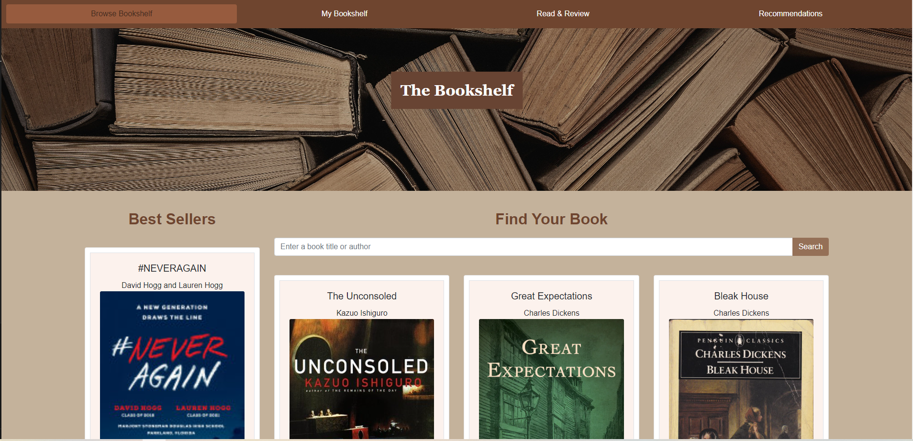
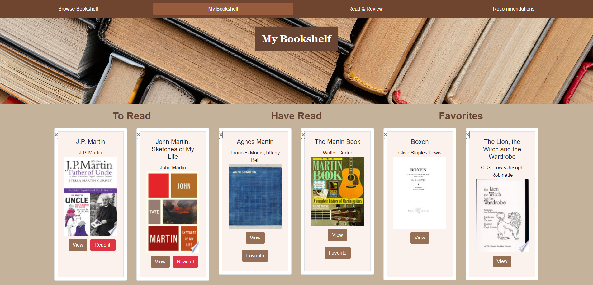
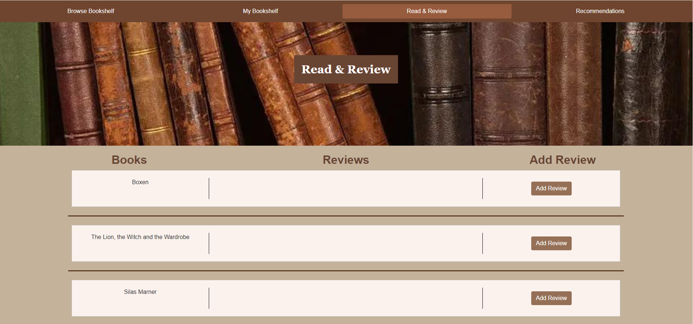
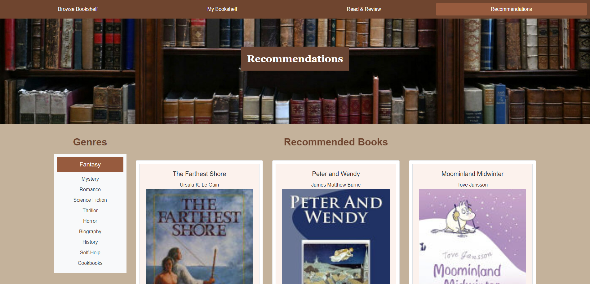

# Bookshelf Web Application
Welcome to the Bookshelf web application! This project provides a platform for users to explore, save, review, and organize books. Whether you're looking for your next favorite read or want to keep track of books you've already enjoyed, this application has you covered.


<details>
  <summary>Table of Contents</summary>
  <ol>
    <li><a href="#Screenshots">Screenshots</a></li>
    <li><a href="#Usage">Usage</a></li>
    <li><a href="#Features">Features</a></li>
    <li><a href="#File Structure">File Structure</a></li>
    <li><a href="#Setup">Setup</a></li>
    <li><a href="#Contributing">Contributing</a></li>
    <li><a href="#Link">Link</a></li>
    <li><a href="#Credits">Credits</a></li>
    <li><a href="#License">License</a></li>
  </ol>
</details>


## Screenshots









## Usage 
Book Discovery: Users can discover new books based on recommendations, best sellers are displayed on the home page and the user can view those books if they are interested. Users can search by author name and discover more books by their favourite author

Book Reviews: Users can read and write reviews to books they've read. Those reviews can be appended or deleted at any time if the user changes their mind on something. 

Book Tracking: User can track books they want to read, have read and then assign those books to favourites if they liked the book. 

## Features

* Browse Bookshelf: Explore different sections of the bookshelf, including best sellers, personalized recommendations, and more.
* Search for Books: Find books by title, author, or genre using the search functionality.
* Save Books: Save your favorite books to your personal bookshelf for easy access.
* Review Books: Add reviews to books you've read and organize them based on your reading status.
* Responsive Design: Enjoy a seamless experience across various devices and screen sizes thanks to the application's responsive design.

## File Structure

The project's file structure is organized as follows:

* index.html: The main HTML file serving as the entry point for the application.
* mybookshelf.html: HTML file for displaying the user's personal bookshelf and saved books.
* readandreview.html: HTML file for reviewing and organizing books.
* recommendation.html: HTML file for displaying personalized book recommendations.
* assets/: Directory containing CSS, JavaScript, and image files.
* styles/: Directory containing the main CSS file for styling the application.
* images/: Directory containing images used in the application.
* scripts/: Directory containing the main JavaScript file for interaction logic.

## Setup
To run the Bookshelf web application locally:

* Clone the repository to your local machine:

    ```
    git@github.com:Dominik-Jad/bookshelf-project.git
    ```

* Open the project directory in your code editor.
* Open the index.html file in a web browser to view the application.

## Contributing
Contributions to the Bookshelf project are welcome! If you have ideas for improvements, new features, or bug fixes, please submit a pull request or open an issue on GitHub.

## Link
https://dominik-jad.github.io/bookshelf-project/

## Credits

Google Books - https://developers.google.com/books

NYT Api - https://developer.nytimes.com/apis

Rapid API - https://rapidapi.com/hub

Trello - https://trello.com/

## License
The Bookshelf web application is licensed under the MIT License.
